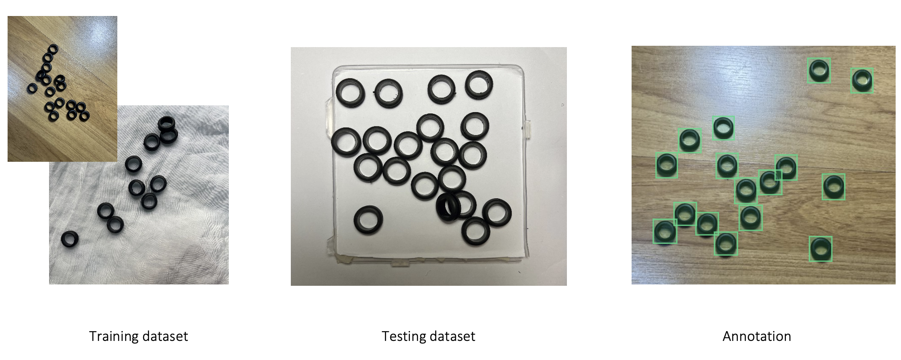
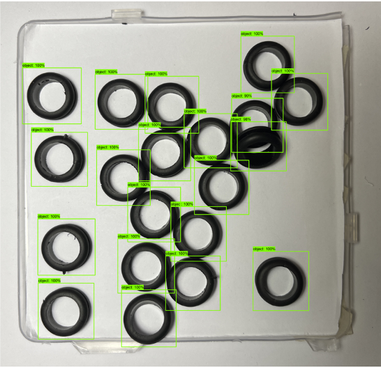
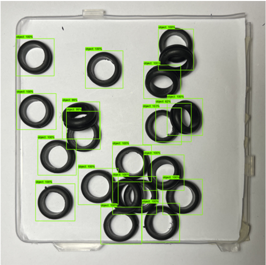

# Rubber Object Detection and Count

## Overview
**A machine learning project to detect and count rubber grommets using SSD (Single Shot MultiBox Detector) with MobileNet v2 and TensorFlow 2.x.**

*This project was developed as a proof of concept to demonstrate object detection and evaluation techniques.*

---

##  Project Objective
This project aims to detect and count rubber grommets in images using object detection techniques. While the results are not yet robust enough for real-time applications in complex scenarios, the model achieved a high F1 score of **97.94%** when tested on a controlled dataset of 50 images.

---

## Tools and Techniques
- **Framework**: TensorFlow Object Detection API
- **Model**: SSD MobileNet (pre-trained on COCO dataset)
- **Annotations**: Created using [makesense.ai](https://makesense.ai/)
- **Programming Language**: Python (TensorFlow, OpenCV, NumPy)

---
## Methodology

### Methodology Flow Chart
Below is the flow chart summarizing the methodology:

---

### Data Preparation
1. **Collect Data**: 
   - Captured images of rubber grommets to create training and testing datasets.

2. **Annotation**:
   - Labeled all objects of interest in the training dataset using annotation tools to define bounding boxes for the grommets.

3. **Preprocessing**:
   - Split the dataset into:
     - **80% Training Dataset**
     - **20% Testing Dataset**
   - Generated CSV files and converted annotations into TensorFlow-compatible `.record` files.

#### Dataset Examples
  

---

### Modeling and Evaluation
1. **Training**:
   - Used a pre-trained SSD Mobilenet V2 model (`ssd_mobilenet_v2_fpnlite_320x320_coco17_tpu-8`) and fine-tuned it on the rubber grommet dataset.
   - Performed training on Google Colab with hyperparameter adjustments:
     - Training Cycle: Ranged between 5,000 to 25,000 steps.
     - Batch Size: Varied from 4 to 32.

2. **Testing**:
   - Evaluated model performance using:
     - Detection count.
     - Correct detection count.
     - Perfect detection images (where all objects are accurately localized).

3. **Hyperparameter Fine-Tuning**:
   - Adjusted the training cycle and batch size iteratively to improve performance.
---

### Performance Evaluation
1. **Result Collection**:
   - Evaluated the model based on:
     - Total detected objects.
     - Number of correctly localized objects.
     - Number of false positives and negatives.

2. **Metrics Used**:
   - **Mean Absolute Percentage Error (MAPE)**: Measures the deviation of predicted counts from actual counts.
   - **Precision**: Measures the percentage of true positives among all detected objects.
   - **Recall**: Measures the ability of the model to detect all objects in the test images.
   - **F1 Score**: Combines precision and recall into a single metric.

---
## Results and Errors

### Results
The model performed well under controlled conditions, detecting and counting rubber grommets with high accuracy.  
[Result Example](detection_examples/15_10k_32) - This is the result example.
- **F1 Score**: **97.94%**  
- Correct detections:  
    

### Errors
Errors occurred primarily when rubber grommets were highly overlapped or touching each other.  
- Example of errors:  
    

---

## Conclusion
- Modifying the training dataset had the most significant impact on improving the model's performance, while hyperparameters like training cycle and batch size also played a role.  
- Errors were more frequent in scenarios with heavily overlapping grommets.  
- Despite the challenges, the model successfully detected and counted rubber grommets in complex scenarios, achieving the project's objectives.  
- This proof of concept provides insights into optimizing object detection for overlapping objects with minimal annotation efforts.  

## Credits and References
- This project builds upon TensorFlow's Object Detection API and annotations created with makesense.ai.

- The implementation and training steps for this project were adapted from the blog post by [Tech Zizou](https://techzizou.in/training-an-ssd-model-for-a-custom-object-using-tensorflow-2-x/). 
Special thanks to the original author for providing a detailed walkthrough and resources that guided the development of this project.

